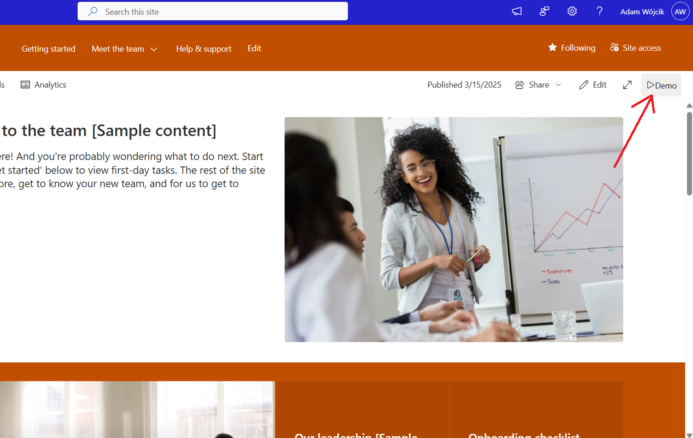
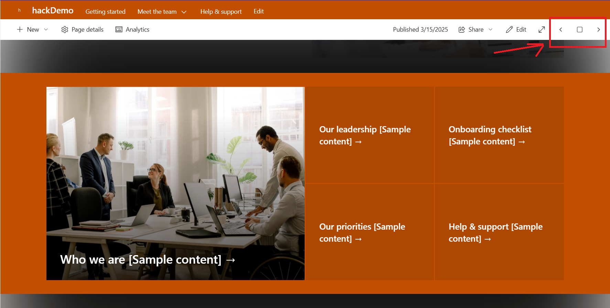
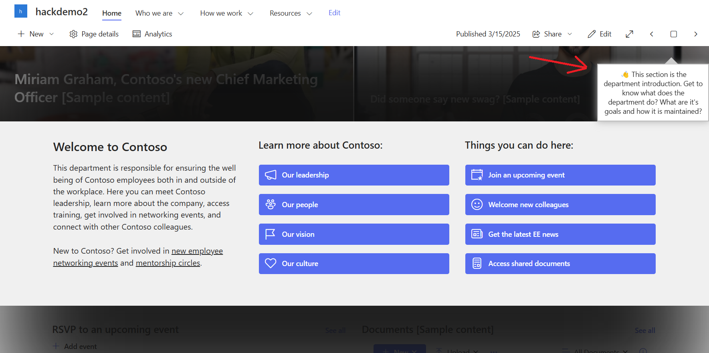

# Demo Time

## Summary

This web part is more a POC created for the SharePoint Hackathon 2025.
This web part allows you to quickly add presentation mode to any page on your site.
It has no UI and is not visible after publish, so not edit mode of the page. After adding it to a page and publishing it will add an additional `Play` in the page header.

After we click on the `Play` button the web part will scroll to the first section to the page and will present the `Previous` and `Next` and `Stop` buttons which allow you to navigate through the page sections, treating each section as a slide.

It is also possible to use a custom `Demo Time` list which you may scaffolding using a CLI for Microsoft 365 script added to this sample. The list allows you to specific a comment which will be shown on a specific page for a specific section.

Check it out in action 👇

It is also possible to run this web part using the following keyboard shortcuts:
`ctrl` + `alt` + `p` - start presentation mode
`ctrl` + `alt` + `right arrow` - next section
`ctrl` + `alt` + `left arrow` - previous section
`ctrl` + `alt` + `s` - stop/end presentation mode

***⚠️ Please be aware***

This web part is using the page DOM as its API which is totally not recommended and may break without any notice from Microsoft side. The way it was created it will only work on communication sites when a specific class to find the page header was found.

## Compatibility

| :warning: Important          |
|:---------------------------|
| Every SPFx version is optimally compatible with specific versions of Node.js. In order to be able to build this sample, you need to ensure that the version of Node on your workstation matches one of the versions listed in this section. This sample will not work on a different version of Node.|
|Refer to <https://aka.ms/spfx-matrix> for more information on SPFx compatibility.   |

This sample is optimally compatible with the following environment configuration:

-Incompatible-red.svg "SharePoint Server 2016 Feature Pack 2 requires SPFx 1.1")

## Applies to

* [SharePoint Framework](https://learn.microsoft.com/sharepoint/dev/spfx/sharepoint-framework-overview)
* [Microsoft 365 tenant](https://learn.microsoft.com/sharepoint/dev/spfx/set-up-your-development-environment)

> Get your own free development tenant by subscribing to [Microsoft 365 developer program](https://aka.ms/m365/devprogram)

## Contributors

* [Adam Wójcik](https://github.com/Adam-it)

## Version history

|Version|Date|Comments|
|-------|----|--------|
|1.0|March 16, 2025|Initial release|

## Minimal path to awesome

* Clone this repository (or [download this solution as a .ZIP file](https://pnp.github.io/download-partial/?url=https://github.com/pnp/sp-dev-fx-webparts/tree/main/samples/js-demo-time) then unzip it)
* From your command line, change your current directory to the directory containing this sample (`js-demo-time`, located under `samples`)
* in the command line run:
  * `npm install`
  * `gulp serve`

Additionally to set comments for each section of a page you need to create the `Demo Time` list. You may do that using the PowerShell script added in the `scripts` folder. It uses [CLI for Microsoft 365](https://pnp.github.io/cli-microsoft365/) commands which you need to have installed beforehand.
After you add the list to the site you may just populate it with comments for each section of every page you want and then the demo time web part during play mode will automatically find and show the comment for the current section.

> This sample can also be opened with [VS Code Remote Development](https://code.visualstudio.com/docs/remote/remote-overview). Visit <https://aka.ms/spfx-devcontainer> for further instructions.

## Features

Description of the web part with possible additional details than in short summary.
This Web Part illustrates the following concepts on top of the SharePoint Framework:

* read content from a SharePoint List
* hack (not recommended) to inject your own HTML to the page DOM

## Help

Search for:
@Adam-it

We do not support samples, but this community is always willing to help, and we want to improve these samples. We use GitHub to track issues, which makes it easy for  community members to volunteer their time and help resolve issues.

If you're having issues building the solution, please run [spfx doctor](https://pnp.github.io/cli-microsoft365/cmd/spfx/spfx-doctor/) from within the solution folder to diagnose incompatibility issues with your environment.

You can try looking at [issues related to this sample](https://github.com/pnp/sp-dev-fx-webparts/issues?q=label%3A%22sample%3A%20js-demo-time%22) to see if anybody else is having the same issues.

You can also try looking at [discussions related to this sample](https://github.com/pnp/sp-dev-fx-webparts/discussions?discussions_q=js-demo-time) and see what the community is saying.

If you encounter any issues using this sample, [create a new issue](https://github.com/pnp/sp-dev-fx-webparts/issues/new?assignees=&labels=Needs%3A+Triage+%3Amag%3A%2Ctype%3Abug-suspected%2Csample%3A%20js-demo-time&template=bug-report.yml&sample=js-demo-time&authors=@Adam-it&title=js-demo-time%20-%20).

For questions regarding this sample, [create a new question](https://github.com/pnp/sp-dev-fx-webparts/issues/new?assignees=&labels=Needs%3A+Triage+%3Amag%3A%2Ctype%3Aquestion%2Csample%3A%20js-demo-time&template=question.yml&sample=js-demo-time&authors=@Adam-it&title=js-demo-time%20-%20).

Finally, if you have an idea for improvement, [make a suggestion](https://github.com/pnp/sp-dev-fx-webparts/issues/new?assignees=&labels=Needs%3A+Triage+%3Amag%3A%2Ctype%3Aenhancement%2Csample%3A%20js-demo-time&template=suggestion.yml&sample=js-demo-time&authors=@Adam-it&title=js-demo-time%20-%20).

## Disclaimer

**THIS CODE IS PROVIDED *AS IS* WITHOUT WARRANTY OF ANY KIND, EITHER EXPRESS OR IMPLIED, INCLUDING ANY IMPLIED WARRANTIES OF FITNESS FOR A PARTICULAR PURPOSE, MERCHANTABILITY, OR NON-INFRINGEMENT.**

